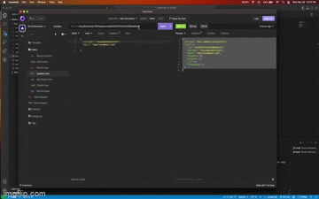
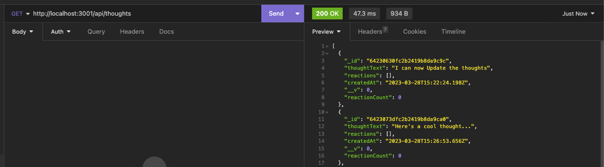
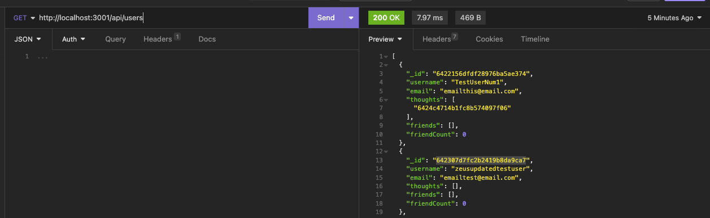

# Social Network API

  ## Description:
  This app would help a startup social media company by giving them an API that uses the NoSQL database so their website can handle large amounts of unstructured data.

  ## Table of Contents:
  - [Installation](#installation)
  - [Usage](#usage)
  - [License](#license)
  - [Contributions](#contributions)
  - [Published Page](#page)
  - [Repo](#repo)

 ## Installation
  Install all of the dependencies in the package.json file by running `npm install`. Once that is done you can run `npm run dev` and it will start the server

 ## Usage 
   Once the server is running you will be able to use all `GET` `POST` `PUT` and `DELETE` routes through insomnia (or another API testing client). 

   Please use the video link below to see it in use. 

 ## License 
  N/A

 ## Contributions 
  N/A

 ## Screen Shot
 
 

# LINKS

 ## Link to Google Drive Video 
https://drive.google.com/file/d/19liKU494Jg0lhVwSi7BeetC7_h7fl_qN/view?usp=sharing

 ## Repo 
 https://github.com/Zcordeiro/Social-Network-Backend

